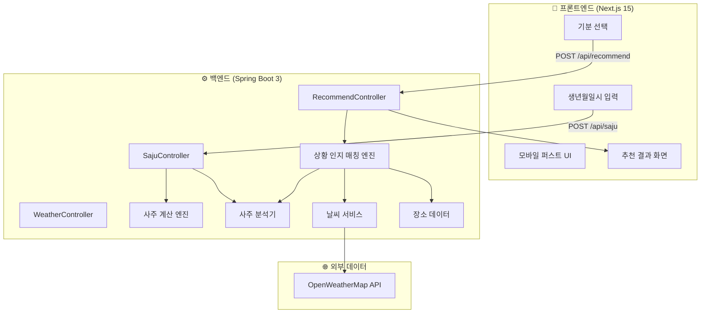

# 사주 표준화 데이터 기반 초개인화 상황 인지 추천 시스템

사용자의 생년월일시를 입력받아 사주팔자를 자동 계산하고, 실시간 환경 데이터(날씨)를 결합하여 최적의 장소·아이템을 추천하는 **모바일 퍼스트 웹앱 프로토타입**을 개발합니다.

---

## User Review Required

> [!IMPORTANT]
> **날씨 API 키 필요**: OpenWeatherMap 무료 API 키가 필요합니다. [openweathermap.org](https://openweathermap.org/api)에서 발급받으셔야 합니다. 프로토타입에서는 목업 데이터 폴백으로 먼저 개발하고, 이후 실제 API 키를 `application.yml`에 설정하면 자동 전환됩니다.

> [!WARNING]
> **감정 분석 제외**: 사용자 요청에 따라 셀카 기반 멀티모달 감정 분석 기능은 제외합니다. 대신 사용자가 현재 기분을 직접 선택하는 UI를 제공합니다.

---

## Open Questions

> [!IMPORTANT]
> **1. 추천 장소 데이터**: 프로토타입에서 사용할 장소 데이터(카페, 음식점, 공원 등)를 서울 기준 목업 데이터셋으로 구성할 예정입니다. 특정 지역이 필요하면 알려주세요.

> [!IMPORTANT]
> **2. 혼잡도 데이터**: SK Open API 등 실시간 혼잡도 연동은 API 키 발급 절차가 복잡합니다. 프로토타입에서는 시간대 기반 추정 혼잡도(mock)로 대체하는 것이 적절할까요?

> [!IMPORTANT]
> **3. Java 버전**: Java 21을 사용할 예정입니다. 현재 설치된 Java 버전을 확인해야 할 수 있습니다.

---

## Architecture Overview



---

## Tech Stack

| 영역 | 기술 | 선정 이유 |
|------|------|-----------|
| **백엔드** | **Spring Boot 3.4** (Java 21, Gradle) | 강력한 REST API, Spring WebClient, 검증된 엔터프라이즈 프레임워크 |
| **프론트엔드** | **Next.js 15** (App Router, TypeScript) | 모바일 퍼스트 SSR, React 기반 UI |
| 스타일링 | **Vanilla CSS** (CSS Custom Properties) | 최대 유연성, 프레임워크 비의존 |
| API 문서화 | **SpringDoc OpenAPI** (Swagger UI) | 자동 API 문서 생성 |
| 날씨 API | **OpenWeatherMap** (Free Tier) | 간편한 연동, 글로벌 커버리지 |
| 폰트 | **Google Fonts** (Pretendard) | 한국어 최적화 타이포그래피 |
| HTTP 통신 | **Spring WebClient** (Reactive) | 비동기 외부 API 호출 |

---

## Proposed Changes

### Part A: 백엔드 (Spring Boot 3)

프로젝트 경로: `/Users/jinjueun/Desktop/Capstone/backend/`

---

#### A1. 프로젝트 초기 설정

##### [NEW] Spring Boot 프로젝트 생성
- Spring Initializr (`start.spring.io`)를 통해 프로젝트 생성
- **Dependencies**: Spring Web, Spring WebFlux (WebClient), SpringDoc OpenAPI, Validation, Lombok
- **Build**: Gradle (Kotlin DSL)
- **Java**: 21
- **Group**: `com.capstone`
- **Artifact**: `saju-recommender`

##### [NEW] [application.yml](file:///Users/jinjueun/Desktop/Capstone/backend/src/main/resources/application.yml)
```yaml
server:
  port: 8080

app:
  weather:
    api-key: ${OPENWEATHER_API_KEY:mock}  # mock이면 목업 데이터 사용
    base-url: https://api.openweathermap.org/data/2.5
  cors:
    allowed-origins: http://localhost:3000  # Next.js 개발 서버

spring:
  threads:
    virtual:
      enabled: true  # Java 21 Virtual Threads
```

##### [NEW] [CorsConfig.java](file:///Users/jinjueun/Desktop/Capstone/backend/src/main/java/com/capstone/sajurecommender/config/CorsConfig.java)
- Next.js 프론트엔드와의 CORS 설정
- 개발/프로덕션 환경별 origin 관리

---

#### A2. 사주 데이터 표준화 엔진 (`features/saju/`)

> 사주명리학의 핵심 계산 로직을 Java로 구현합니다.

##### [NEW] [SajuConstants.java](file:///Users/jinjueun/Desktop/Capstone/backend/src/main/java/com/capstone/sajurecommender/features/saju/domain/SajuConstants.java)
사주 계산에 필요한 모든 상수 데이터:
- **천간(天干)** 10개: 甲乙丙丁戊己庚辛壬癸 — `enum HeavenlyStem`
- **지지(地支)** 12개: 子丑寅卯辰巳午未申酉戌亥 — `enum EarthlyBranch`
- **오행(五行)** 5가지: 木火土金水 — `enum Element`
- **음양(陰陽)**: 각 천간/지지의 음양 속성 — `enum YinYang`
- **십신(十神)**: 일간 기준 십신 관계 매핑 테이블
- **지장간(藏干)**: 12지지별 숨겨진 천간 데이터
- **24절기 경계 데이터**: 월주 판단용 (연도별 절기 시작일시)

##### [NEW] [Pillar.java](file:///Users/jinjueun/Desktop/Capstone/backend/src/main/java/com/capstone/sajurecommender/features/saju/domain/Pillar.java)
사주 기둥(柱) 도메인 객체:
```java
public record Pillar(
    HeavenlyStem stem,      // 천간
    EarthlyBranch branch,   // 지지
    Element stemElement,     // 천간의 오행
    Element branchElement,   // 지지의 오행
    YinYang yinYang         // 음양
) {}
```

##### [NEW] [FourPillars.java](file:///Users/jinjueun/Desktop/Capstone/backend/src/main/java/com/capstone/sajurecommender/features/saju/domain/FourPillars.java)
사주팔자(四柱八字) 도메인 객체:
```java
public record FourPillars(
    Pillar yearPillar,   // 년주
    Pillar monthPillar,  // 월주
    Pillar dayPillar,    // 일주
    Pillar hourPillar    // 시주
) {}
```

##### [NEW] [SajuCalculator.java](file:///Users/jinjueun/Desktop/Capstone/backend/src/main/java/com/capstone/sajurecommender/features/saju/service/SajuCalculator.java)
사주팔자 자동 계산 핵심 엔진 (`@Service`):
- `calculateYearPillar(int year)`: 연주 — `(year - 4) % 60` 기반 60갑자
- `calculateMonthPillar(int year, int month, int day)`: 월주 — 절기 기반 월 판단 + 연간 기준 월간 배정
- `calculateDayPillar(LocalDate date)`: 일주 — 기준일(1900.1.1=甲子)로부터 경과일 기반
- `calculateHourPillar(HeavenlyStem dayStem, int hour)`: 시주 — 둔간법(遁干法) 적용
- `calculate(LocalDateTime birthDateTime)`: 통합 사주팔자 산출

##### [NEW] [SajuAnalyzer.java](file:///Users/jinjueun/Desktop/Capstone/backend/src/main/java/com/capstone/sajurecommender/features/saju/service/SajuAnalyzer.java)
사주 데이터를 마케팅 변수로 변환 (`@Service`):
- `analyzeElements(FourPillars)`: 오행 분포 분석 (과다/부족 판단)
- `getDailyFortune(FourPillars, LocalDate)`: 오늘의 운세 점수 (0~100)
- `getLuckyAttributes(FourPillars)`: 길한 색상·방위·숫자·음식 카테고리
- `getPersonalityProfile(FourPillars)`: 성격 프로파일 (키워드 기반)
- `toMarketingVariables(FourPillars)`: 마케팅 변수로 변환

##### [NEW] [SajuController.java](file:///Users/jinjueun/Desktop/Capstone/backend/src/main/java/com/capstone/sajurecommender/features/saju/controller/SajuController.java)
사주 계산 REST API:
- `POST /api/saju/calculate` — 생년월일시 → 표준화된 사주 프로파일 반환
- `POST /api/saju/daily-fortune` — 사주 프로파일 기반 오늘의 운세

##### [NEW] DTO 클래스들
- `SajuRequest`: 생년월일시, 양력/음력, 성별
- `SajuProfileResponse`: 사주팔자 + 분석 결과 + 마케팅 변수 통합 응답
- `DailyFortuneResponse`: 오늘의 운세 점수 + 길한 속성

---

#### A3. 날씨 서비스 (`features/weather/`)

##### [NEW] [WeatherService.java](file:///Users/jinjueun/Desktop/Capstone/backend/src/main/java/com/capstone/sajurecommender/features/weather/service/WeatherService.java)
실시간 날씨 데이터 수집 (`@Service`):
- `getCurrentWeather(double lat, double lon)`: OpenWeatherMap API 호출
- 날씨 데이터 → 오행 매핑 (맑음=火, 비=水, 흐림=金, 바람=木, 습함=土)
- API 키가 `mock`이면 시간대 기반 목업 날씨 반환
- `WebClient`를 사용한 비동기 HTTP 호출

##### [NEW] [WeatherController.java](file:///Users/jinjueun/Desktop/Capstone/backend/src/main/java/com/capstone/sajurecommender/features/weather/controller/WeatherController.java)
- `GET /api/weather?lat={lat}&lon={lon}` — 현재 날씨 + 오행 매핑 정보

---

#### A4. 상황 인지 매칭 엔진 (`features/recommend/`)

##### [NEW] [PlaceData.java](file:///Users/jinjueun/Desktop/Capstone/backend/src/main/java/com/capstone/sajurecommender/features/recommend/data/PlaceData.java)
장소·아이템 데이터:
- 서울 기준 50+ 장소 (카페/음식점/공원/문화공간/쇼핑)
- 각 장소: 오행 속성, 추천 메뉴, 가격대, 분위기 태그, 위치(위도/경도)
- 연계 소비 아이템 (메뉴, 상품) 정보

##### [NEW] [ContextEngine.java](file:///Users/jinjueun/Desktop/Capstone/backend/src/main/java/com/capstone/sajurecommender/features/recommend/service/ContextEngine.java)
상황 인지 컨텍스트 통합 (`@Service`):
- 사주 프로파일 + 현재 날씨 + 시간대 + 기분 통합
- 가중치 기반 상황 벡터 생성
- 시간대별 추정 혼잡도 계산 (mock)

##### [NEW] [RecommendationEngine.java](file:///Users/jinjueun/Desktop/Capstone/backend/src/main/java/com/capstone/sajurecommender/features/recommend/service/RecommendationEngine.java)
최적 추천 점수 산출 (`@Service`):

```
추천점수 = (사주적합도 × 0.35) + (날씨적합도 × 0.20) 
         + (기분적합도 × 0.25) + (시간적합도 × 0.10) 
         + (혼잡도점수 × 0.10)
```

- 장소별 오행 속성 ↔ 사주 부족 오행 매칭
- 기분 기반 활동 유형 필터링
- Top-N 추천 결과 + 추천 이유 텍스트 생성

##### [NEW] [RecommendController.java](file:///Users/jinjueun/Desktop/Capstone/backend/src/main/java/com/capstone/sajurecommender/features/recommend/controller/RecommendController.java)
추천 REST API:
- `POST /api/recommend` — 사주 프로파일 + 기분 + 위치 → 추천 결과 반환
- 응답: 추천 장소 목록 + 점수 + 추천 이유 + 연계 아이템

---

#### A5. 백엔드 패키지 구조

```
backend/src/main/java/com/capstone/sajurecommender/
├── SajuRecommenderApplication.java
├── config/
│   ├── CorsConfig.java
│   ├── WebClientConfig.java
│   └── SwaggerConfig.java
├── common/
│   ├── exception/
│   │   ├── GlobalExceptionHandler.java
│   │   └── ApiException.java
│   └── dto/
│       └── ApiResponse.java          # 공통 응답 래퍼
├── features/
│   ├── saju/
│   │   ├── controller/
│   │   │   └── SajuController.java
│   │   ├── service/
│   │   │   ├── SajuCalculator.java   # 사주 계산 엔진
│   │   │   └── SajuAnalyzer.java     # 사주 분석기
│   │   ├── domain/
│   │   │   ├── SajuConstants.java    # Enum 상수들
│   │   │   ├── Pillar.java
│   │   │   └── FourPillars.java
│   │   └── dto/
│   │       ├── SajuRequest.java
│   │       └── SajuProfileResponse.java
│   ├── weather/
│   │   ├── controller/
│   │   │   └── WeatherController.java
│   │   ├── service/
│   │   │   └── WeatherService.java
│   │   └── dto/
│   │       └── WeatherResponse.java
│   └── recommend/
│       ├── controller/
│       │   └── RecommendController.java
│       ├── service/
│       │   ├── ContextEngine.java
│       │   └── RecommendationEngine.java
│       ├── data/
│       │   └── PlaceData.java
│       └── dto/
│           ├── RecommendRequest.java
│           └── RecommendResponse.java
└── resources/
    ├── application.yml
    └── data/
        └── places.json               # 장소 목업 데이터
```

---

### Part B: 프론트엔드 (Next.js 15)

프로젝트 경로: `/Users/jinjueun/Desktop/Capstone/frontend/`

---

#### B1. 프로젝트 초기 설정

##### [NEW] Next.js 프로젝트 생성
- `npx create-next-app@latest ./` — TypeScript, App Router, ESLint
- CSS Modules 사용 (Tailwind 비사용)
- Spring Boot 백엔드 프록시 설정 (`next.config.ts`)

---

#### B2. 디자인 시스템

##### [NEW] [globals.css](file:///Users/jinjueun/Desktop/Capstone/frontend/app/globals.css)
- **테마**: "우주와 운명" — 딥 퍼플/네이비 배경 + 골드/에메랄드 악센트
- **오행 컬러**: 목(#4CAF50) 화(#FF5722) 토(#FFC107) 금(#E0E0E0) 수(#2196F3)
- **글래스모피즘**: `backdrop-filter: blur()` 기반 카드
- **애니메이션**: 사주 기둥 등장, 오행 차트 확장, 추천 카드 스와이프
- **반응형**: 모바일 퍼스트 (360px → 768px → 1024px)

---

#### B3. 화면 구성 (5개 메인 화면)

##### Screen 1: 온보딩 / 랜딩 — [page.tsx](file:///Users/jinjueun/Desktop/Capstone/frontend/app/page.tsx)
- 앱 소개 + "나의 사주 알아보기" 버튼
- 동양적 패턴 배경 CSS 애니메이션 (별자리/파티클)
- 서비스 소개 카드 3개 (사주 분석, 맞춤 추천, 콘텐츠 커머스)

##### Screen 2: 사주 입력 — [input/page.tsx](file:///Users/jinjueun/Desktop/Capstone/frontend/app/input/page.tsx)
- 생년월일시 입력 폼 (날짜 선택 + 시간 드롭다운)
- 양력/음력 토글 스위치
- 성별 선택 라디오
- 실시간 사주 미리보기 (입력 중 천간지지 라이브 표시)
- `POST /api/saju/calculate` 호출

##### Screen 3: 사주 분석 결과 — [result/page.tsx](file:///Users/jinjueun/Desktop/Capstone/frontend/app/result/page.tsx)
- 사주 명반 시각화 (4개 기둥 카드 — 스태거 애니메이션)
- 오행 분포 **레이더 차트** (CSS/SVG 기반)
- 성격 키워드 태그 클라우드
- 오늘의 운세 **원형 게이지**
- 길한 속성 카드 (색상, 방위, 음식)
- "맞춤 추천 받기" CTA 버튼

##### Screen 4: 기분 & 상황 입력 — [context/page.tsx](file:///Users/jinjueun/Desktop/Capstone/frontend/app/context/page.tsx)
- 이모지 기반 기분 선택 6가지: 😊 행복, 😔 우울, 😤 짜증, 😌 평온, 🤔 고민, 🎉 신남
- 위치 자동 감지 (Geolocation API) + 수동 선택 드롭다운
- 현재 날씨 카드 (날씨 API 연동)
- "나에게 맞는 장소 찾기" 버튼

##### Screen 5: 추천 결과 — [recommendations/page.tsx](file:///Users/jinjueun/Desktop/Capstone/frontend/app/recommendations/page.tsx)
- 추천 장소 카드 리스트 (매칭 점수 순)
- 각 카드: 장소명, 이미지, 추천 이유, 매칭 점수 바
- 연계 아이템 캐러셀 (추천 메뉴, 상품)
- "왜 이 장소를 추천했나요?" 접기/펴기 (사주 기반 설명)
- 오행 매칭 시각화

---

#### B4. 공통 컴포넌트

| 컴포넌트 | 설명 |
|----------|------|
| `PillarCard` | 사주 기둥 1개 (천간/지지/오행 색상 코딩) |
| `ElementChart` | 오행 분포 레이더 차트 (SVG) |
| `MoodSelector` | 이모지 기반 기분 선택 위젯 |
| `PlaceCard` | 추천 장소 카드 (이미지 + 점수 + 설명) |
| `ScoreGauge` | 원형 점수 게이지 (SVG) |
| `WeatherCard` | 현재 날씨 표시 카드 |
| `Navigation` | 하단 네비게이션 바 (모바일) |
| `LoadingSpinner` | 로딩 애니메이션 (오행 심볼 회전) |
| `ItemCarousel` | 연계 아이템 슬라이드 캐러셀 |

---

#### B5. 프론트엔드 프로젝트 구조

```
frontend/
├── app/
│   ├── input/page.tsx               # 사주 입력
│   ├── result/page.tsx              # 사주 분석 결과
│   ├── context/page.tsx             # 기분 & 상황 입력
│   ├── recommendations/page.tsx     # 추천 결과
│   ├── globals.css                  # 디자인 시스템
│   ├── layout.tsx                   # 루트 레이아웃
│   └── page.tsx                     # 온보딩/랜딩
├── components/
│   ├── PillarCard.tsx
│   ├── ElementChart.tsx
│   ├── MoodSelector.tsx
│   ├── PlaceCard.tsx
│   ├── ScoreGauge.tsx
│   ├── WeatherCard.tsx
│   ├── Navigation.tsx
│   ├── LoadingSpinner.tsx
│   └── ItemCarousel.tsx
├── lib/
│   └── api.ts                       # Spring Boot API 호출 유틸
├── types/
│   └── saju.ts                      # TypeScript 타입 정의
├── next.config.ts
├── package.json
└── tsconfig.json
```

---

## API 스펙 요약

| Method | Endpoint | 설명 | Request | Response |
|--------|----------|------|---------|----------|
| `POST` | `/api/saju/calculate` | 사주 계산 | 생년월일시, 성별 | 사주 프로파일 전체 |
| `POST` | `/api/saju/daily-fortune` | 오늘의 운세 | 사주 프로파일 | 운세 점수 + 길한 속성 |
| `GET` | `/api/weather` | 날씨 조회 | lat, lon | 날씨 + 오행 매핑 |
| `POST` | `/api/recommend` | 추천 요청 | 사주 + 기분 + 위치 | Top-N 추천 장소 + 아이템 |

---

## Verification Plan

### Automated Tests

1. **사주 계산 정확도 검증**
   - 알려진 유명인의 사주 데이터로 계산 결과 교차 검증
   - `./gradlew test` 로 JUnit 테스트 실행
   - 다양한 날짜 범위 (1950~2025) 에지 케이스 테스트

2. **API 통합 테스트**
   - `@SpringBootTest` + `WebTestClient`로 각 엔드포인트 검증
   - Swagger UI (`/swagger-ui.html`) 에서 수동 API 테스트

3. **빌드 검증**
   - 백엔드: `./gradlew build` 성공 확인
   - 프론트엔드: `npm run build` 성공 확인

### Manual Verification

1. **모바일 UI 검증**
   - 프론트엔드 `npm run dev` (3000번 포트) + 백엔드 `./gradlew bootRun` (8080번 포트)
   - 모바일 뷰포트에서 전체 사용자 플로우 확인

2. **E2E 사용자 시나리오**
   - 생년월일시 입력 → 사주 분석 → 기분 선택 → 추천 결과 → 아이템 탐색

---

## 구현 순서

| 단계 | 영역 | 내용 | 예상 시간 |
|------|------|------|-----------|
| 1 | 백엔드 | 프로젝트 초기화 + 설정 (Gradle, CORS, Swagger) | 15분 |
| 2 | 백엔드 | 사주 상수 & 도메인 모델 (`SajuConstants`, `Pillar`, `FourPillars`) | 25분 |
| 3 | 백엔드 | 사주 계산 엔진 (`SajuCalculator`) | 30분 |
| 4 | 백엔드 | 사주 분석기 (`SajuAnalyzer`) + DTO + Controller | 25분 |
| 5 | 백엔드 | 날씨 서비스 (`WeatherService`) | 15분 |
| 6 | 백엔드 | 장소 데이터 + 매칭 엔진 (`RecommendationEngine`) | 25분 |
| 7 | 프론트 | 프로젝트 초기화 + 디자인 시스템 (CSS) | 15분 |
| 8 | 프론트 | 온보딩 & 사주 입력 화면 | 25분 |
| 9 | 프론트 | 사주 분석 결과 화면 | 30분 |
| 10 | 프론트 | 기분/상황 입력 + 추천 결과 화면 | 30분 |
| 11 | 통합 | API 연동 + 통합 테스트 + 폴리싱 | 25분 |
